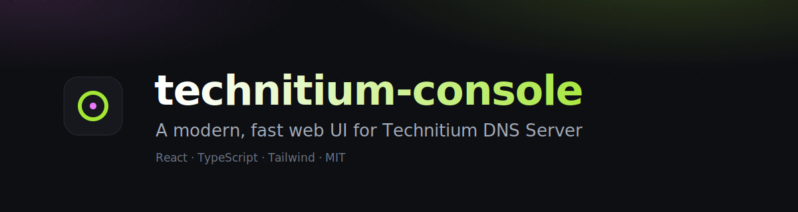
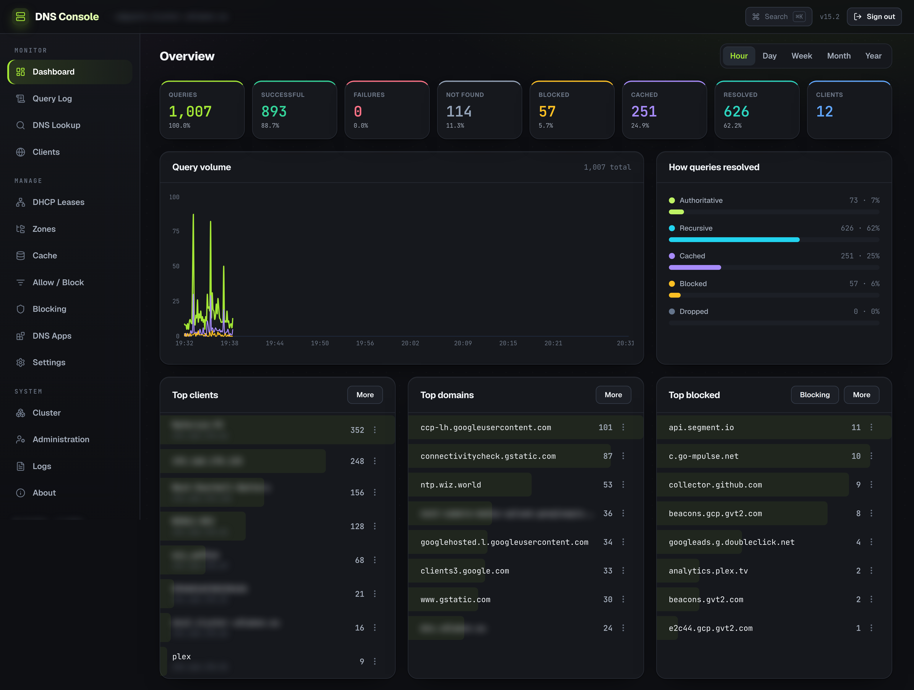

# technitium-console

A modern, fast web UI for [Technitium DNS Server](https://github.com/TechnitiumSoftware/DnsServer), built on its REST API.

[](LICENSE)
[](https://github.com/maferick/technitium-console/actions/workflows/ci.yml)
[](CONTRIBUTING.md)


> Not affiliated with Technitium. This is an independent, alternative front-end. The DNS server itself is a separate project.



## Why this exists

I run Technitium and like it a lot, but I never warmed to the stock admin UI. So I built my own from
scratch, as a single-page app on top of Technitium's REST API. It started as a personal project; it
turned out fairly complete, so I'm sharing it. **Use it, fork it, adapt it, ship it, whatever you
like** (MIT). No warranty, no strings.

It is a drop-in *alternative* console: it talks to your existing, unmodified Technitium server. The
original UI keeps working alongside it.

Full disclosure: I'm not really a developer. I built this with a lot of help from Claude (Anthropic's
AI), and honestly had a blast doing it. So if the code makes a seasoned dev wince here and there, that
is why, and PRs are very welcome. :D

## Screenshot



> Client names and internal domains are blurred above; everything else is the real UI.

## Features

Near-complete parity with the stock admin UI, plus a few quality-of-life extras:

- **Dashboard** with query-volume chart, resolution breakdown, and top clients / domains / blocked,
  each with row quick-actions (show in query log, resolve, block/allow) and a "top 1000" view.
- **Query Log** browser: searchable and filterable, with inline block/allow.
- **Zones**: create/delete, record editor, per-zone **Options** (query access, zone transfer + TSIG,
  notify, dynamic updates + security policies, catalog), and the full **DNSSEC lifecycle** (sign with
  options, key states, rollover/retire, NSEC/NSEC3, DS records).
- **DHCP**: leases (reserve in one click) and a full scope editor (every option).
- **Cache** browser, **Allow/Block** lists, **Apps** (install/update/config + store).
- **Settings**: general, forwarders & proxy, recursion, blocking, TSIG keys, web service & TLS,
  optional protocols (DoT/DoH/DoQ), and backup & restore.
- **Administration**: sessions, users, groups, an editable permissions matrix, API tokens, SSO (OIDC).
- **DNS Lookup**, **Clustering** status, **logs** viewer.
- A `Cmd/Ctrl-K` command palette, keyboard-friendly, dark, responsive.

## Quick start (Docker)

The container serves the UI and reverse-proxies `/api` to your Technitium server, so the browser
stays same-origin (no CORS, the session token stays first-party). Point it at your server with
`TECHNITIUM_UPSTREAM` (`host:port` of the Technitium web service, default port `5380`):

```bash
docker run -d --name technitium-console \
  -e TECHNITIUM_UPSTREAM=192.168.1.5:5380 \
  -p 8080:80 \
  ghcr.io/maferick/technitium-console:latest
```

Then open `http://localhost:8080` and log in with your Technitium credentials.

Or with Compose (see [`docker-compose.yml`](docker-compose.yml)):

```bash
TECHNITIUM_UPSTREAM=192.168.1.5:5380 docker compose up -d
```

### Build the image yourself

```bash
docker build -t technitium-console .
docker run -d -e TECHNITIUM_UPSTREAM=192.168.1.5:5380 -p 8080:80 technitium-console
```

## Configuration

| Variable | Default | Description |
| --- | --- | --- |
| `TECHNITIUM_UPSTREAM` | `technitium:5380` | `host:port` of your Technitium DNS Server web service that `/api` is proxied to. |

Put it behind your own reverse proxy for HTTPS, and restrict access the same way you would any DNS
admin panel (VPN, IP allow-list, or auth at the proxy). See [SECURITY.md](SECURITY.md).

## Development

Requires Node 20+ and a reachable Technitium server.

```bash
npm install
TECHNITIUM_DEV_PROXY=http://192.168.1.5:5380 npm run dev
```

Vite proxies `/api` to `TECHNITIUM_DEV_PROXY` (default `http://localhost:5380`). See
[CONTRIBUTING.md](CONTRIBUTING.md) for the project layout and conventions.

## Compatibility

Built against the Technitium DNS Server v13+ REST API. Technitium evolves its API between releases;
if something looks off after a server upgrade, please open an issue with your server version.

## Known limitations

- **Block-list URL domains aren't browsable per-domain.** The Allow/Block screen lists and manages
  the domains you add or remove yourself. Domains pulled in from block-list URLs (there can be
  hundreds of thousands) live in a separate zone that the Technitium API doesn't enumerate
  individually, so they don't show up in that list. Blocking still applies to all of them; the
  dashboard shows the totals, and you manage those lists via the block-list URLs under Settings.

## Contributing

Issues and PRs are welcome, see [CONTRIBUTING.md](CONTRIBUTING.md). There is no CLA; contributions are
MIT, same as the rest of the project. Found a security problem? See [SECURITY.md](SECURITY.md).

## Acknowledgements

All the hard parts (DNS, DHCP, DNSSEC, the API) are [Technitium DNS Server](https://github.com/TechnitiumSoftware/DnsServer)
by Shreyas Zare. This project is just a different coat of paint on top, so consider it a long-form
feature request with the implementation already attached.

## License

[MIT](LICENSE)
